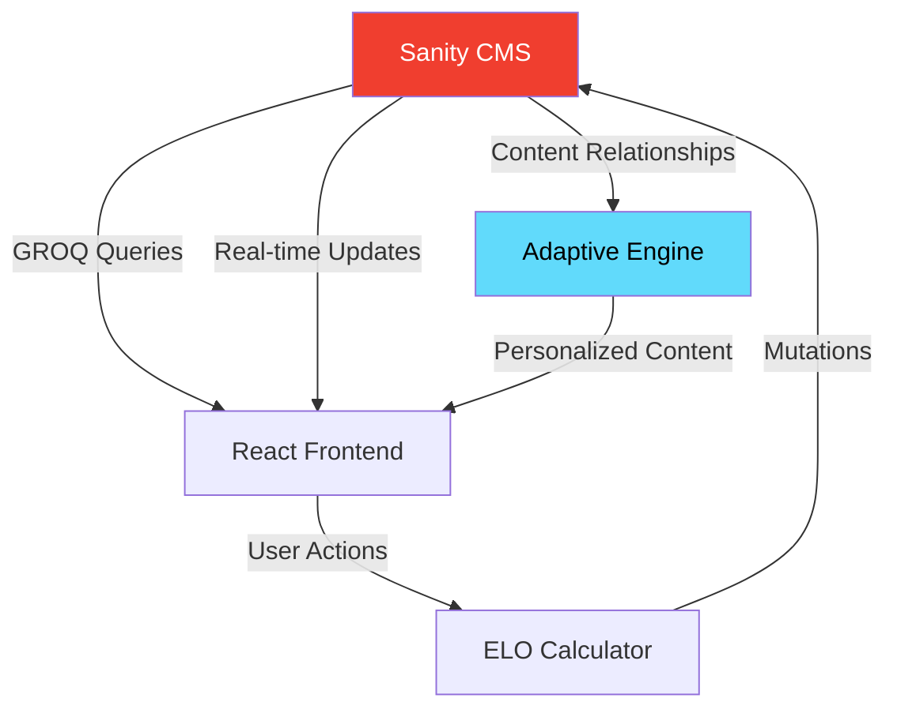
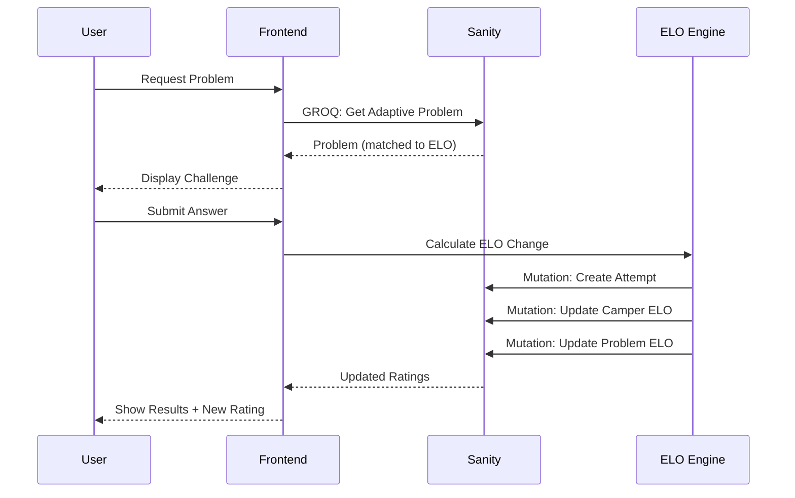

<div align="center">

# Math Wilderness

### Where Structured Content Powers Adaptive Learning

[](https://www.sanity.io)
[](https://react.dev)
[](https://www.typescriptlang.org)
[](https://vercel.com)

**An adaptive math learning platform where content relationships create intelligent education**

[Live Demo](#) • [Documentation](#features) • [Setup Guide](#quick-start)

</div>

---

## The Innovation

Math Wilderness isn't just another learning app. It's a demonstration of **structured content as intelligence**. Using Sanity's relational content model, we built an adaptive learning system where:

- Concepts unlock dynamically based on prerequisite relationships
- Problems adapt difficulty using ELO ratings and concept weights
- Learning paths emerge from content structure, not hard-coded logic
- AI development accelerated through Sanity's MCP server

### Why This Matters

Traditional learning platforms store content in flat databases. We store **relationships**:

```
Concept → Prerequisites → Mastery Check → Unlock
Problem → Concept Weights → ELO Match → Adaptive Delivery
Attempt → Rating Update → Difficulty Adjust → Optimal Challenge
```

Change curriculum in Sanity Studio and the app updates instantly. No code deployment needed.

---

## Architecture: Sanity at the Core

<div align="center">



</div>

### Content Schema (7 Document Types)

#### 1. **Camper** (User Profile)
```typescript
{
  name: string
  email: string
  mascot: reference<Mascot>
  eloRating: number (default: 1000)
  xp: number
  level: number
  streakDays: number
  masteredConcepts: reference<Concept>[]
  currentConcept: reference<Concept>
  preferences: {
    hintsEnabled: boolean
    timerEnabled: boolean
    soundEnabled: boolean
  }
}
```

#### 2. **Concept** (Learning Topics)
```typescript
{
  title: string
  slug: slug
  difficultyBase: number
  mapPosition: {x: number, y: number}
  biome: 'meadow' | 'forest' | 'mountain' | 'canyon' | 'peak'
  prerequisites: reference<Concept>[]  // Enables dynamic unlocking
  learningObjectives: text[]
  badge: reference<Badge>
}
```

#### 3. **Problem** (Adaptive Challenges)
```typescript
{
  title: string
  questionText: text
  correctAnswer: string
  answerType: 'multipleChoice' | 'numeric' | 'expression'
  difficultyElo: number
  conceptBreakdown: {              // Composite difficulty
    concept: reference<Concept>
    weight: number (0-1)
  }[]
  hints: text[]
  attemptsCount: number
  successRate: number
}
```

#### 4. **Attempt** (Learning History)
```typescript
{
  camper: reference<Camper>
  problem: reference<Problem>
  concept: reference<Concept>
  isCorrect: boolean
  responseTime: number
  eloChange: number               // Rating adjustment
  timestamp: datetime
}
```

#### 5-7. **Mascot**, **Badge**, **DailyQuest**
Supporting content for gamification and engagement.

---

## The Adaptive Engine

### ELO Rating System

We use a chess-style rating algorithm with educational adaptations:

```typescript
// Expected score based on rating difference
expected = 1 / (1 + 10^((problemElo - camperElo) / 400))

// Uncertainty-weighted K-factor (decreases as data accumulates)
K = 4 / (1 + 0.5 * attemptCount)

// Rating update
newElo = oldElo + K * (actualScore - expected)
```

**Why this works:**
- New problems have high K-factor → ratings adjust quickly
- Established problems stabilize → reliable difficulty markers
- Both camper AND problem ratings update → system self-balances

### Dynamic Content Unlocking

**GROQ Query** for available concepts:
```groq
*[_type == "concept"]{
  _id,
  title,
  prerequisites[]->{_id},
  "isUnlocked": count(prerequisites) == 0 || 
    count(prerequisites[!(_ref in $masteredConcepts)]) == 0
}
```

**Result:** Change prerequisites in Sanity Studio and the map updates instantly.

### Adaptive Problem Selection

**GROQ Query** for optimal challenge:
```groq
*[_type == "problem" && 
  references($conceptId) && 
  difficultyElo >= $camperElo - 100 && 
  difficultyElo <= $camperElo + 100 &&
  !(_id in $attemptedProblems)
] | order(abs(difficultyElo - $camperElo)) [0]
```

**Result:** Always delivers problems in the zone of proximal development.

---

## Features

### For Learners
- Adaptive Difficulty: Problems match your skill level using ELO ratings
- Progressive Unlocking: Master concepts to unlock new challenges
- Mascot Companions: Choose Swift Squirrel, Steady Moose, or Wise Owl
- Achievement System: Earn badges and track progress
- Real-time Leaderboard: Compete with other campers
- Streak Tracking: Build daily learning habits

### For Educators
- Content Authoring: Create problems and concepts in Sanity Studio
- Relationship Management: Define prerequisites visually
- Analytics Dashboard: Track success rates and difficulty calibration
- No-code Customization: Update mascot dialogue, badges, quests
- Instant Publishing: Changes go live immediately

### For Developers
- Structured Schema: Normalized, extensible content model
- Powerful Queries: GROQ traverses relationships effortlessly
- AI-Assisted Development: Built with Sanity MCP server
- Real-time Updates: Sanity webhooks + React Query
- Beautiful UI: Custom SVG illustrations, smooth animations

---

## Tech Stack

<div align="center">

| Layer | Technology | Purpose |
|-------|-----------|---------|
| **CMS** |  | Structured content, relationships, real-time |
| **Frontend** |  | UI components, state management |
| **Language** |  | Type safety, developer experience |
| **Styling** |  | Utility-first CSS, custom design system |
| **Data Fetching** |  | Server state, caching, real-time sync |
| **Build** |  | Fast builds, HMR, optimized production |
| **Deployment** |  | Edge network, instant deploys |
| **AI Dev** |  | Schema generation, content population |

</div>

---

## Quick Start

### Prerequisites
- Node.js 18+
- Sanity account ([free tier](https://www.sanity.io/get-started))

### 1. Clone & Install
```bash
git clone https://github.com/Tasfia-17/mathwilderness.git
cd mathwilderness
npm install
```

### 2. Setup Sanity Backend
```bash
cd sanity
npx sanity init
# Follow prompts to create project
npx sanity start
```

Sanity Studio opens at `http://localhost:3333`

### 3. Configure Environment
```bash
cp .env.example .env.local
```

Edit `.env.local`:
```env
NEXT_PUBLIC_SANITY_PROJECT_ID=your-project-id
NEXT_PUBLIC_SANITY_DATASET=production
SANITY_API_TOKEN=your-token
```

### 4. Populate Sample Data

In Sanity Studio, create:

**3 Mascots:**
- Swift Squirrel (Energetic, Fast)
- Steady Moose (Patient, Methodical)
- Wise Owl (Analytical, Strategic)

**4 Concepts (with prerequisites):**
1. Algebra Trail (difficulty: 800, no prerequisites)
2. Geometry Grove (difficulty: 1000, requires: Algebra)
3. Calculus Canyon (difficulty: 1200, requires: Geometry)
4. Trigonometry Peak (difficulty: 1400, requires: Calculus)

**10+ Problems** for each concept with varying ELO (700-1500)

### 5. Run Development Server
```bash
npm run dev
```

App opens at `http://localhost:5173`

---

## Key Concepts

### Content Relationships Drive Intelligence

**Traditional Approach:**
```javascript
// Hard-coded logic
if (user.level >= 5 && user.completedAlgebra) {
  unlockGeometry()
}
```

**Math Wilderness Approach:**
```groq
// Query-driven logic
*[_type == "concept" && 
  count(prerequisites[!(_ref in $mastered)]) == 0]
```

**Result:** Add new concepts, change prerequisites, reorder curriculum—all in Sanity Studio without code changes.

### Composite Difficulty Scoring

**Problem Schema:**
```json
{
  "title": "Pythagorean Theorem Application",
  "conceptBreakdown": [
    {"concept": "geometry", "weight": 0.7},
    {"concept": "algebra", "weight": 0.3}
  ]
}
```

**Adaptive Matching:**
```typescript
// Calculate effective difficulty based on learner's ratings
effectiveDifficulty = 
  (geometryRating * 0.7) + (algebraRating * 0.3)
```

**Result:** Problems test multiple concepts, difficulty adapts to specific strengths.

---

## UI Highlights

### Camping Theme Throughout
- Treehouse Welcome: Illustrated SVG onboarding
- Forest Learning Map: Interactive concept nodes
- Mountain Progress: Visual difficulty progression
- Campfire Social: Leaderboard with starry night
- Trophy Room: Badge collection display

### Custom SVG Illustrations
- 15+ hand-drawn scenes
- Parallax effects on dashboard
- Animated mascot companions
- Warm autumn color palette (OKLCH)

### Smooth Animations
- Framer Motion page transitions
- Badge unlock celebrations
- Progress bar animations
- Hover effects throughout

---

## Development with Sanity MCP

We used Sanity's MCP server with Claude Code to accelerate development:

### Schema Generation
**Prompt:**
```
Create a Sanity schema for adaptive learning with:
- User profiles with ELO ratings
- Concepts with prerequisite relationships
- Problems with composite difficulty
```

**Result:** Complete TypeScript schemas with validation in minutes.

### Content Population
**Prompt:**
```
Generate 10 algebra problems with:
- Varying difficulty (700-900 ELO)
- Progressive hints
- Concept breakdowns
```

**Result:** Structured sample data ready for testing.

### Query Refinement
**Prompt:**
```
Write a GROQ query to find problems matching:
- User's current concept
- ELO within ±100
- Not previously attempted
- Ordered by closest match
```

**Result:** Optimized query with proper reference traversal.

---

## Data Flow



---

## Use Cases

### 1. Adaptive Homework Platform
Schools deploy with custom curriculum. Teachers author content in Sanity Studio, students get personalized problem sets.

### 2. Test Prep Service
SAT/ACT prep with ELO-matched practice. Diagnostic tests identify weak areas, system generates targeted drills.

### 3. Corporate Training
Replace math with compliance topics. Same adaptive engine, different content domain.

### 4. Research Platform
Education researchers study learning patterns. Sanity's query API provides rich analytics data.

---

## Deployment

### Vercel (Recommended)
```bash
# Connect GitHub repo to Vercel
# Add environment variables in dashboard
# Deploy automatically on push
```

### Sanity Studio
```bash
cd sanity
npx sanity deploy
# Studio hosted at: your-project.sanity.studio
```

### Environment Variables
```env
# Frontend (.env.local)
NEXT_PUBLIC_SANITY_PROJECT_ID=abc123
NEXT_PUBLIC_SANITY_DATASET=production
SANITY_API_TOKEN=sk...

# Sanity Studio (sanity.config.ts)
projectId: 'abc123'
dataset: 'production'
```

---

## Future Enhancements

### Enabled by Structured Content

- AI Problem Generation: Use concept breakdowns as prompts for GPT-4
- Spaced Repetition: Query attempt history for optimal review timing
- Social Learning: Camper-to-camper references for peer challenges
- Curriculum Marketplace: Share concept trees between educators
- Multi-language: Localize content without code changes
- Accessibility: Store alternative formats (audio, braille) as content

### Technical Roadmap

- [ ] Real-time multiplayer challenges
- [ ] Voice input for answers
- [ ] LaTeX rendering for complex equations
- [ ] Mobile app (React Native)
- [ ] Offline mode with sync
- [ ] Parent/teacher dashboard

---

## Documentation

- [Sanity Setup Guide](./SANITY_SETUP.md) - Detailed backend configuration
- [Schema Reference](./sanity/schemas/) - All document types
- [GROQ Queries](./src/lib/sanity.ts) - Query examples
- [ELO System](./docs/elo-algorithm.md) - Rating calculation details
- [Content Guidelines](./docs/content-authoring.md) - For educators

---

## Contributing

We welcome contributions! Areas of interest:

- Content Creation: Add math problems, concepts, badges
- UI/UX: Improve illustrations, animations, accessibility
- Features: Implement roadmap items
- Documentation: Tutorials, guides, translations
- Testing: Unit tests, E2E tests, load testing

See [CONTRIBUTING.md](./CONTRIBUTING.md) for guidelines.

---

## License

MIT License - see [LICENSE](./LICENSE)

---

## Acknowledgments

- Sanity.io: For the incredible CMS and MCP server
- Vercel: For seamless deployment
- React Team: For the amazing framework
- Education Community: For feedback and inspiration

---

## Contact

- GitHub: [@Tasfia-17](https://github.com/Tasfia-17)
- Project: [mathwilderness](https://github.com/Tasfia-17/mathwilderness)
- Demo: [Live App](#)

---

<div align="center">

**Built with structured content using Sanity**

[](https://www.sanity.io)

Demonstrating that structured content + AI = intelligent education

</div>
